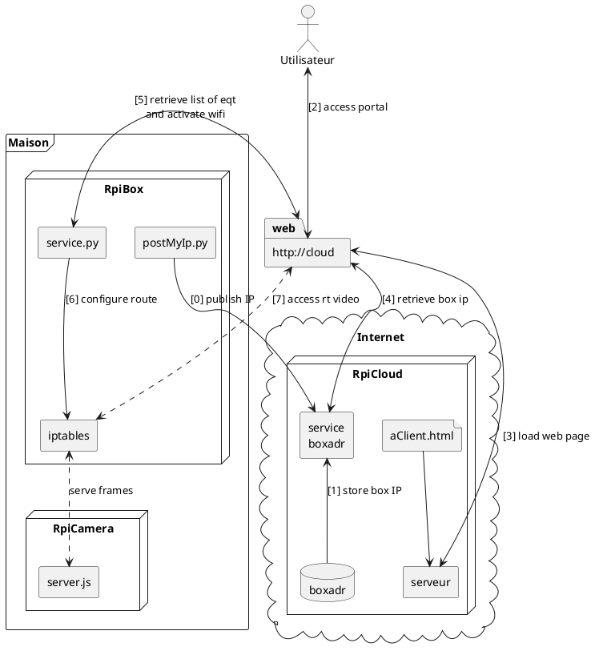
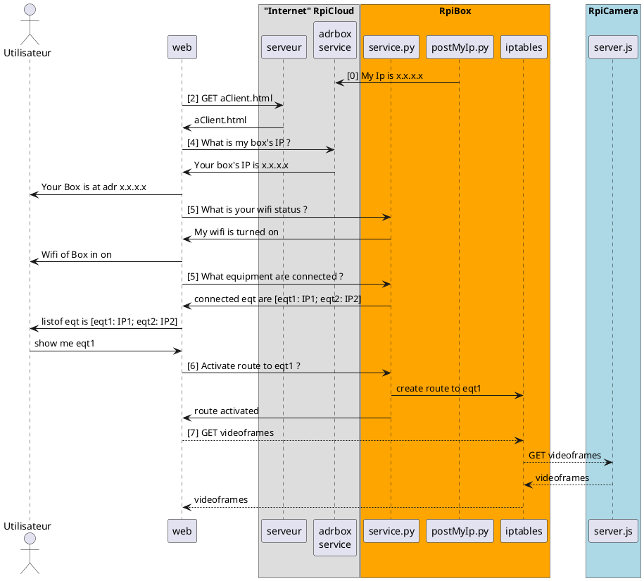
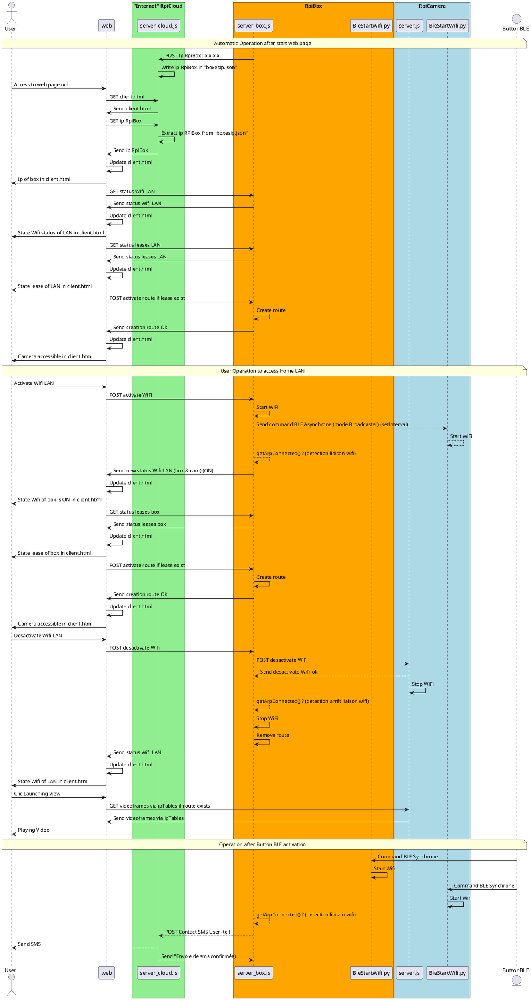

```plantuml
@startuml
actor Utilisateur 

package web as  "http://cloud" 

cloud Internet{
    node RpiCloud {
        database boxadr
        rectangle serveur 
        rectangle "service\nboxadr" as sbadr
        file aClient.html as webpage
    }
}

    frame Maison{
        node RpiBox{
            rectangle "service.py" as boxservice
            rectangle "postMyIp.py" as ipposter
            rectangle "iptables" as iptables
        }
        node RpiCamera {
            rectangle "server.js" as camserveur
        }
}

ipposter --> sbadr : [0] publish IP
sbadr <-- boxadr : [1] store box IP
Utilisateur <--> web : [2] access portal
web <--> serveur : [3] load web page
web <--> sbadr : [4] retrieve box ip
web <--> boxservice : [5] retrieve list of eqt\nand activate wifi
boxservice --> iptables : [6] configure route

webpage --> serveur

iptables <-[dashed]-> web : [7] access rt video
iptables <-[dashed]-> camserveur : serve frames
@enduml
```

```plantuml
@startuml
actor Utilisateur
participant web as webbrowser
box "Internet" RpiCloud
participant serveur as webserver
participant "adrbox\nservice" as boxip
end box
box "Maison" #LightBlue

box "RpiBox" #Orange
participant service.py as boxservice
participant postMyIp.py as ipposter
participant iptables as iptables
endbox
box "RpiCamera" #LightBlue
participant server.js as camserver
endbox
endbox

ipposter -> boxip : [0] My Ip is x.x.x.x
webbrowser -> webserver : [2] GET aClient.html
webserver -> webbrowser : aClient.html
webbrowser -> boxip : [4] What is my box's IP ?
boxip -> webbrowser : Your box's IP is x.x.x.x
webbrowser -> Utilisateur : Your Box is at adr x.x.x.x
webbrowser -> boxservice : [5] What is your wifi status ?
boxservice -> webbrowser : My wifi is turned on
webbrowser -> Utilisateur : Wifi of Box in on
webbrowser -> boxservice : [5] What equipment are connected ?
boxservice -> webbrowser : connected eqt are [eqt1: IP1; eqt2: IP2]
webbrowser -> Utilisateur : listof eqt is [eqt1: IP1; eqt2: IP2]
Utilisateur -> webbrowser : show me eqt1
webbrowser -> boxservice : [6] Activate route to eqt1 ?
boxservice -> iptables : create route to eqt1
boxservice -> webbrowser : route activated

webbrowser --> iptables : [7] GET videoframes
iptables --> camserver : GET videoframes
camserver --> iptables : videoframes
iptables --> webbrowser : videoframes

@enduml
```

```plantuml
@startuml
actor User
participant web as webbrowser
box "Internet" RpiCloud #Lightgreen
    participant server_cloud.js as cloudserver
endbox
box "Maison" 
    box "RpiBox" #Orange
        participant server_box.js as boxsserver
        participant BleStartWifi.py as bleBox
    endbox
    box "RpiCamera" #LightBlue
        participant server.js as camserver
        participant BleStartWifi.py as bleCamera
    endbox
endbox
entity ButtonBLE

note over User, ButtonBLE
Automatic Operation after start web page
end note

boxsserver -> cloudserver : POST Ip RpiBox : x.x.x.x
cloudserver -> cloudserver : Write ip RpiBox in "boxesip.json"
User -> webbrowser : Access to web page url 
webbrowser -> cloudserver : GET client.html
cloudserver -> webbrowser : Send client.html
webbrowser -> cloudserver : GET ip RpiBox
cloudserver -> cloudserver :Extract ip RPiBox from "boxesip.json"
cloudserver -> webbrowser : Send ip RpiBox
webbrowser -> webbrowser : Update client.html
webbrowser -> User : Ip of box in client.html
webbrowser -> boxsserver : GET status Wifi LAN
boxsserver -> webbrowser : Send status Wifi LAN
webbrowser -> webbrowser : Update client.html
webbrowser -> User : State Wifi status of LAN in client.html
webbrowser -> boxsserver : GET status leases LAN
boxsserver -> webbrowser : Send status leases LAN
webbrowser -> webbrowser : Update client.html
webbrowser -> User : State lease of LAN in client.html
webbrowser -> boxsserver : POST activate route if lease exist
boxsserver -> boxsserver : Create route
boxsserver -> webbrowser : Send creation route Ok
webbrowser -> webbrowser : Update client.html
webbrowser -> User : Camera accessible in client.html

note over User, ButtonBLE
User Operation to access Home LAN
end note

User -> webbrowser : Activate Wifi LAN
webbrowser -> boxsserver : POST activate WiFi
boxsserver -> boxsserver : Start WiFi
boxsserver --> bleCamera : Send command BLE Asynchrone (mode Broadcaster) (setInterval)
bleCamera --> bleCamera : Start WiFi 
boxsserver --> boxsserver : getArpConnected() ? (detection liaison wifi)
boxsserver -> webbrowser : Send new status Wifi LAN (box & cam) (ON)
webbrowser -> webbrowser : Update client.html
webbrowser -> User : State Wifi of box is ON in client.html
webbrowser -> boxsserver : GET status leases box
boxsserver -> webbrowser : Send status leases box
webbrowser -> webbrowser : Update client.html
webbrowser -> User : State lease of box in client.html
webbrowser -> boxsserver : POST activate route if lease exist
boxsserver -> boxsserver : Create route
boxsserver -> webbrowser : Send creation route Ok
webbrowser -> webbrowser : Update client.html
webbrowser -> User : Camera accessible in client.html
User -> webbrowser : Desactivate Wifi LAN
webbrowser -> boxsserver : POST desactivate WiFi
boxsserver --> camserver : POST desactivate WiFi
camserver --> boxsserver : Send desactivate WiFi ok
camserver -> camserver : Stop WiFi
boxsserver --> boxsserver : getArpConnected() ? (detection arrêt liaison wifi)
boxsserver -> boxsserver : Stop WiFi
boxsserver -> boxsserver : Remove route
boxsserver -> webbrowser : Send status Wifi LAN
webbrowser -> webbrowser : Update client.html
webbrowser -> User : State Wifi of LAN in client.html
User -> webbrowser : Clic Launching View
webbrowser -> camserver : GET videoframes via ipTables if route exists
camserver -> webbrowser : Send videoframes via ipTables
webbrowser -> User : Playing Video

note over User, ButtonBLE
Operation after Button BLE activation
end note

ButtonBLE -> bleBox : Command BLE Synchrone
bleBox -> bleBox : Start Wifi
ButtonBLE -> bleCamera : Command BLE Synchrone
bleCamera -> bleCamera : Start Wifi
boxsserver --> boxsserver : getArpConnected() ? (detection liaison wifi)
boxsserver --> cloudserver : POST Contact SMS User (tel)
cloudserver --> User : Send SMS
cloudserver --> boxsserver : Send "Envoie de sms confirmée)
@enduml
```

