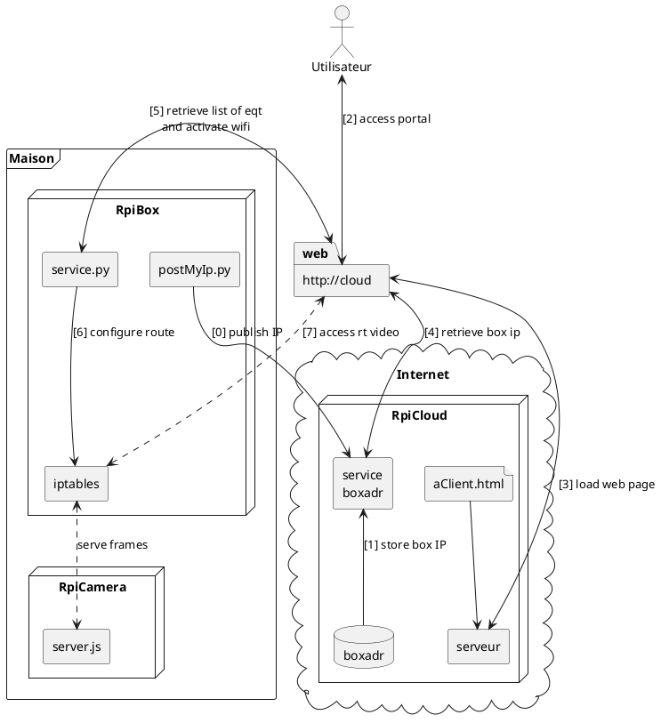
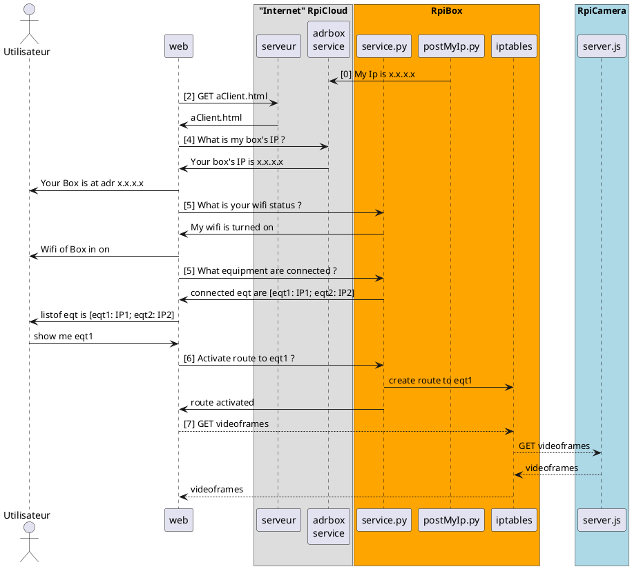

```plantuml
@startuml
actor Utilisateur

package    web as  "http://cloud"

cloud Internet{
    node RpiCloud {
        database boxadr
        rectangle serveur 
        rectangle "service\nboxadr" as sbadr
        file aClient.html as webpage
    }
}

    frame Maison{
        node RpiBox{
            rectangle "service.py" as boxservice
            rectangle "postMyIp.py" as ipposter
            rectangle "iptables" as iptables
        }
        node RpiCamera {
            rectangle "server.js" as camserveur
        }
}

ipposter --> sbadr : [0] publish IP
sbadr <-- boxadr : [1] store box IP
Utilisateur <--> web : [2] access portal
web <--> serveur : [3] load web page
web <--> sbadr : [4] retrieve box ip
web <--> boxservice : [5] retrieve list of eqt\nand activate wifi
boxservice --> iptables : [6] configure route

webpage --> serveur

iptables <-[dashed]-> web : [7] access rt video
iptables <-[dashed]-> camserveur : serve frames
@enduml
```

```plantuml
@startuml
actor Utilisateur
participant web as webbrowser
box "Internet" RpiCloud
participant serveur as webserver
participant "adrbox\nservice" as boxip
end box
box "Maison" #LightBlue

box "RpiBox" #Orange
participant service.py as boxservice
participant postMyIp.py as ipposter
participant iptables as iptables
endbox
box "RpiCamera" #LightBlue
participant server.js as camserver
endbox
endbox

ipposter -> boxip : [0] My Ip is x.x.x.x
webbrowser -> webserver : [2] GET aClient.html
webserver -> webbrowser : aClient.html
webbrowser -> boxip : [4] What is my box's IP ?
boxip -> webbrowser : Your box's IP is x.x.x.x
webbrowser -> Utilisateur : Your Box is at adr x.x.x.x
webbrowser -> boxservice : [5] What is your wifi status ?
boxservice -> webbrowser : My wifi is turned on
webbrowser -> Utilisateur : Wifi of Box in on
webbrowser -> boxservice : [5] What equipment are connected ?
boxservice -> webbrowser : connected eqt are [eqt1: IP1; eqt2: IP2]
webbrowser -> Utilisateur : listof eqt is [eqt1: IP1; eqt2: IP2]
Utilisateur -> webbrowser : show me eqt1
webbrowser -> boxservice : [6] Activate route to eqt1 ?
boxservice -> iptables : create route to eqt1
boxservice -> webbrowser : route activated

webbrowser --> iptables : [7] GET videoframes
iptables --> camserver : GET videoframes
camserver --> iptables : videoframes
iptables --> webbrowser : videoframes

@enduml
```

